# CSTC Introduction
This document serves as a written introduction to the Cyber Security Transformation Chef or in short: CSTC. It starts by giving an overview of the general UI of the tool and after that walking through a demonstrative use-case explaining the core functionalities along the way.

## UI Overview

### Main Panel

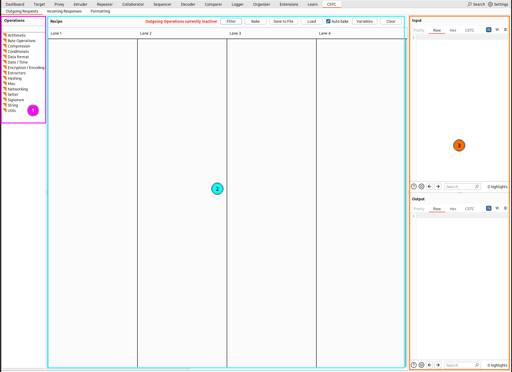

The UI can be divided into three functional areas.<br>
On the far left **(1)** is the area for selecting operations, grouped categorically. These are added to the recipe in the appropriate lane via click-and-drag. There is a search bar above the operations tree for quick access.<br>
The recipe panel is located in the middle **(2)**. This is made up of up to 10 lanes, whereby the operations are applied in the order from top to bottom and left to right. Each lane works anew on the input sent to the CSTC. This makes it possible to carry out several transformations on the same input.<br>
Finally, the selection area on the right **(3)** provides an overview of the initial development of a recipe and is used for debugging a recipe. The input to be worked with is shown in the upper area, and the lower area shows the result after the recipe has been applied.


### Filter

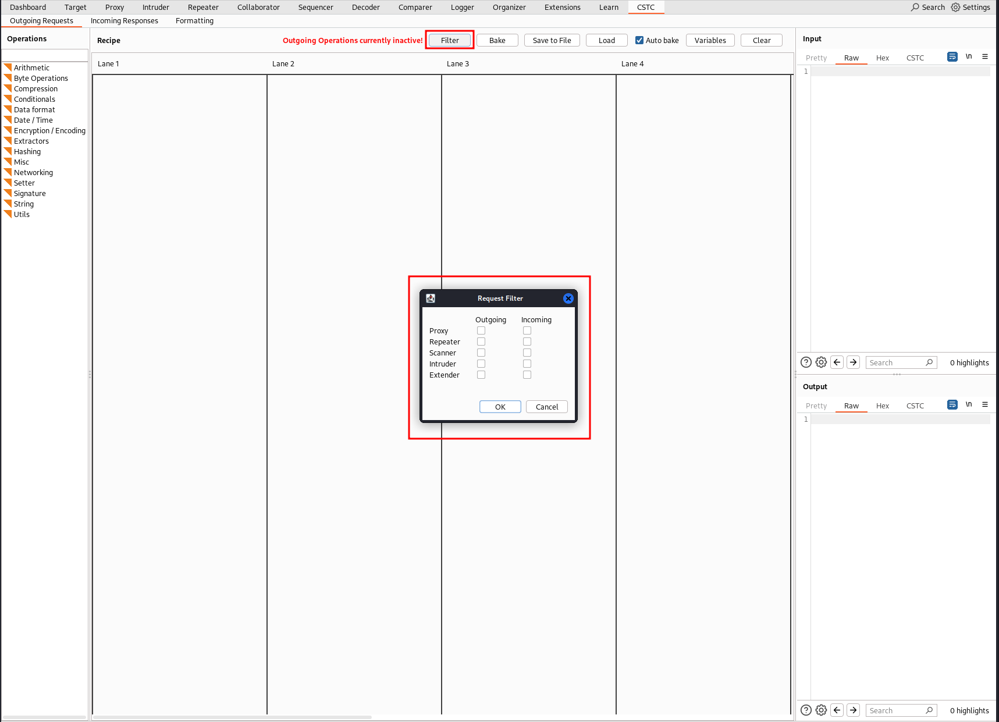

The CSTC enables HTTP requests and responses to be changed automatically according to the given recipe. The tabs for which the recipes are to be applied are selected using the ```Filter``` button at the top middle of the recipe panel. This opens the pop-up window for selection.


### Different Recipes

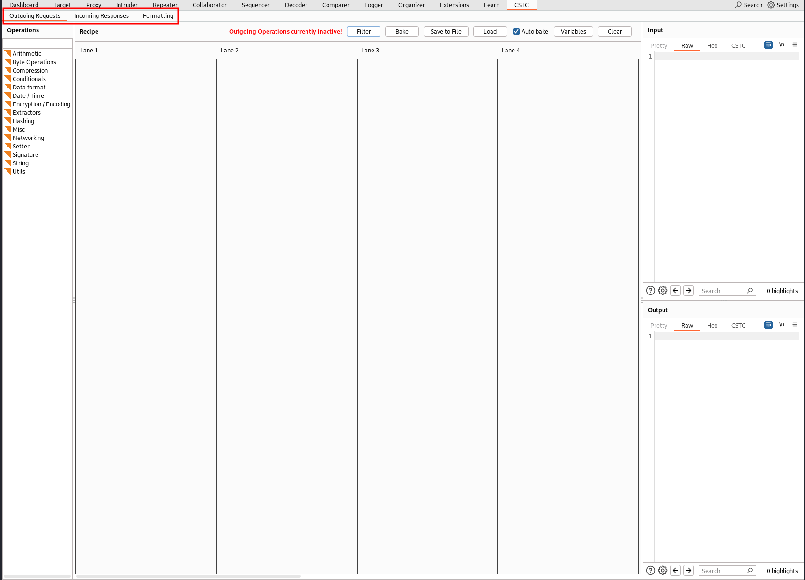

The CSTC enables parallel work with HTTP requests and responses. Exactly one recipe can be created for each of them. Which recipe you are currently working on is controlled via the tab selection in the top left corner. In the tab ```Outgoing Requests``` you work on the HTTP requests, in ```Incoming Responses``` you work analogously on the HTTP responses. The third tab ```Formatting``` offers space to work with data independently of requests and responses and has no effect on regarding automatic transformation of requests/responses. It can be used to test recipes or perform static transformations comparable to the GCHQ CyberChef.


## Example 1 - Response

We will now look at two examples using a demo application. A detailed video demonstration of the CSTC can be found [here](https://www.youtube.com/watch?v=6fjW4iXj5cg).

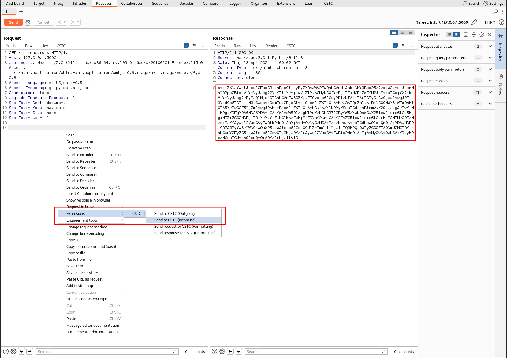

In this first example we see a HTTP request and its response in the Repeater tab. The body of the response is encoded and to create a matching recipe with the CSTC, we send the response to the ```Incoming``` tab.<br>
Note here that the menu for sending the HTTP request to the CSTC can also be called up in the Proxy tab and, above all, in the HTTP history.

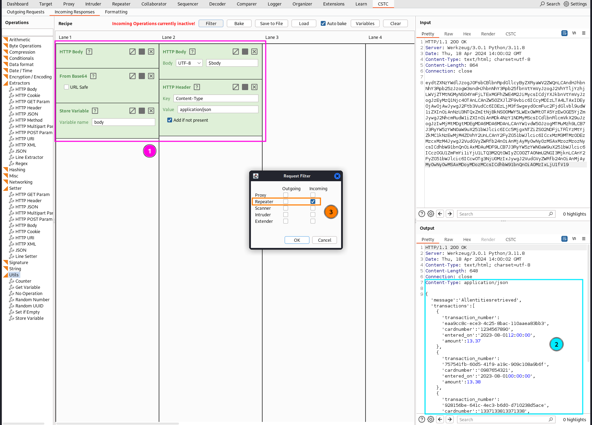

Now the appropriate recipe must be created. In this case we use two lanes **(1)**: In the first, we extract the body of the HTTP response, decode it and store it in a variable named ```body```. In the second lane, we replace the body of the original HTTP response with the body we have manipulated and stored in the variable. We also add a suitable Content-Type header so that Burpsuite knows how to display the data in pretty print. We see the result on the right **(2)**. We finally instruct the CSTC to apply this recipe to all incoming responses in the Repeater tab **(3)**.

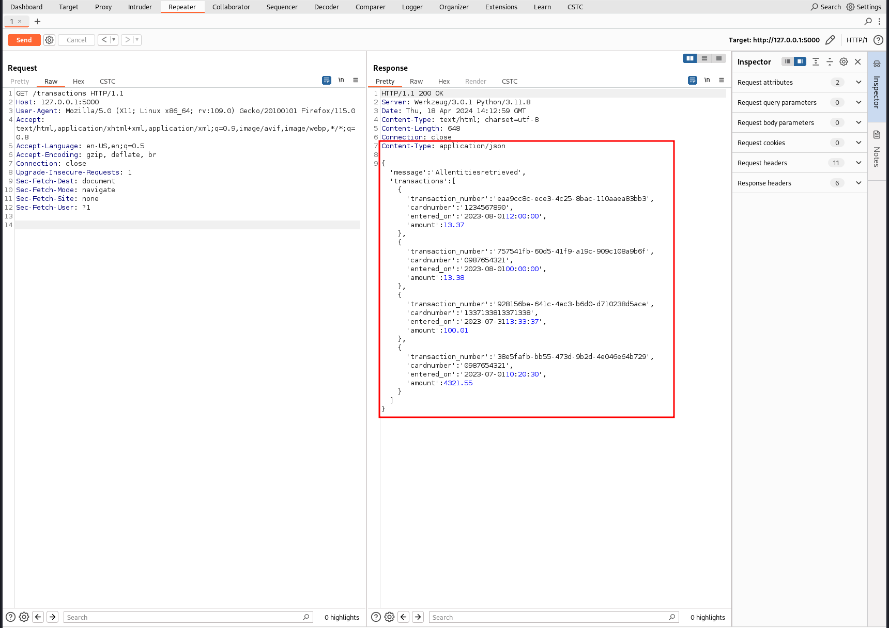

If we now resend our request in the Repeater tab, we see that the recipe is working.


## Example 2 - Request

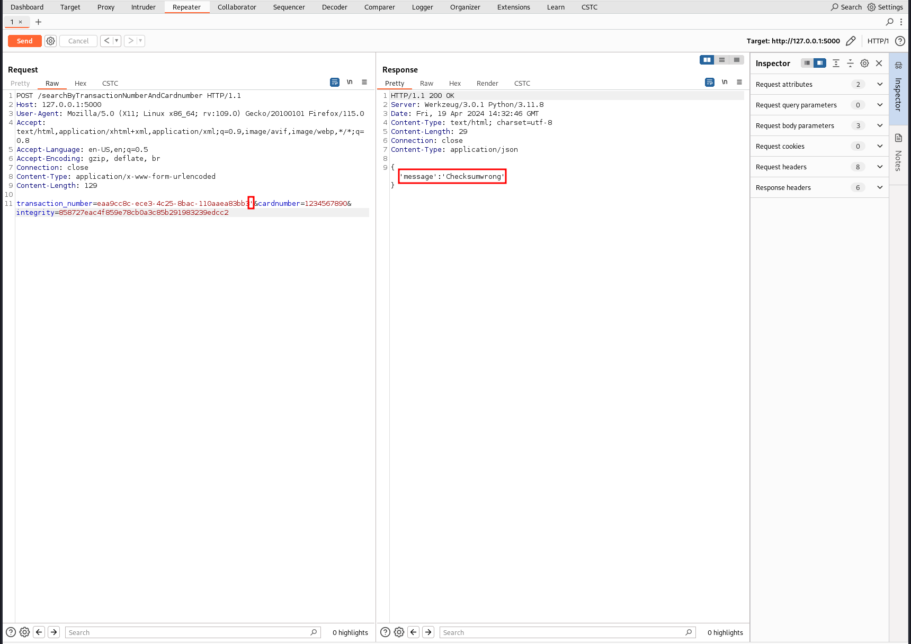

For a second example, let's take a look at this HTTP POST request. We have three POST parameters and want to test the first parameter for SQL Injection. However, every time the value is changed, the API responds with an error message that the checksum is incorrect. In this case we found out that the values of the first two parameters are concatenated and then the SHA1 value is calculated of the resulting string. The result is cross-checked with the value of the integrity parameter. With the help of the CSTC, this scheme can be automatically applied to all outgoing requests and the testing process is greatly simplified.

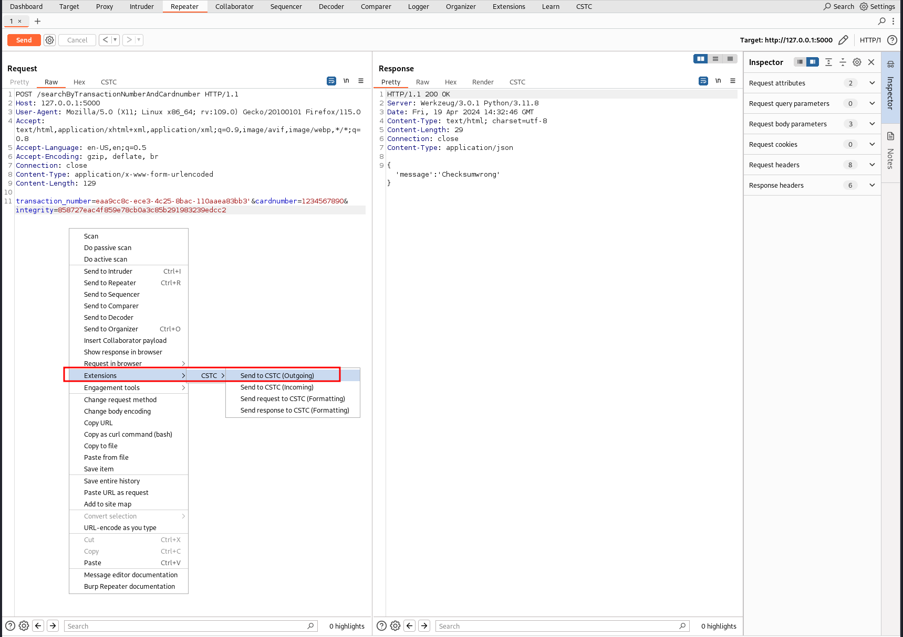

As before, we send the data to the CSTC to be able to work with it. This time we work with the HTTP request, so we send it to the ```Outgoing``` tab.

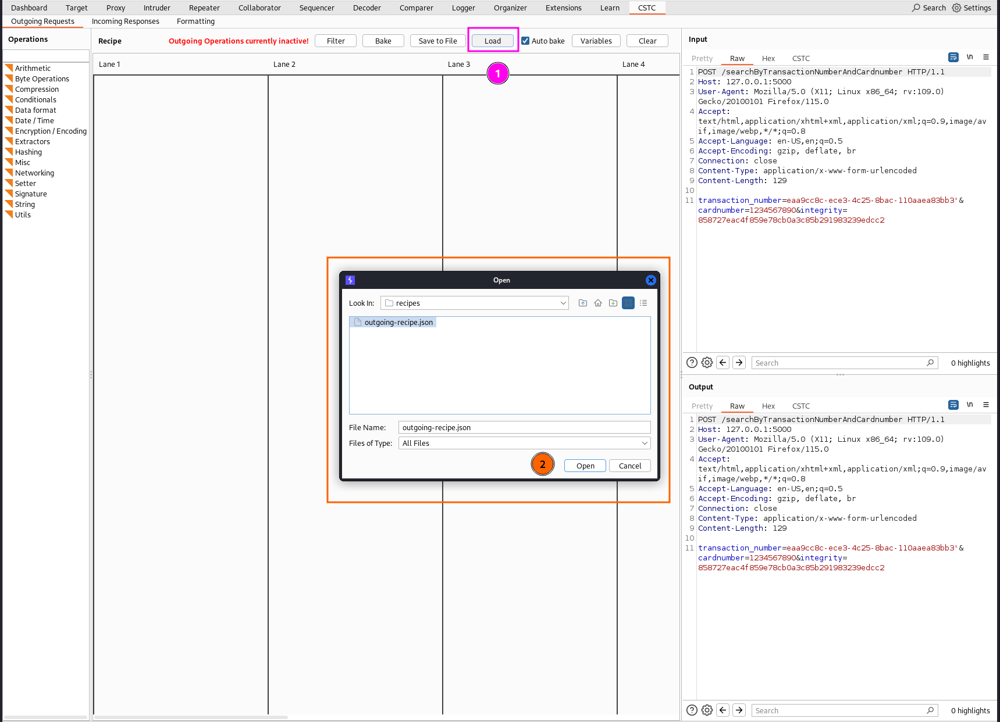

At this point, another feature of the CSTC can be demonstrated. Created recipes can be saved in the local file system and reloaded if necessary. Here, selecting ```Load``` **(1)** opens a pop-up and the saved recipe can be selected **(2)**.

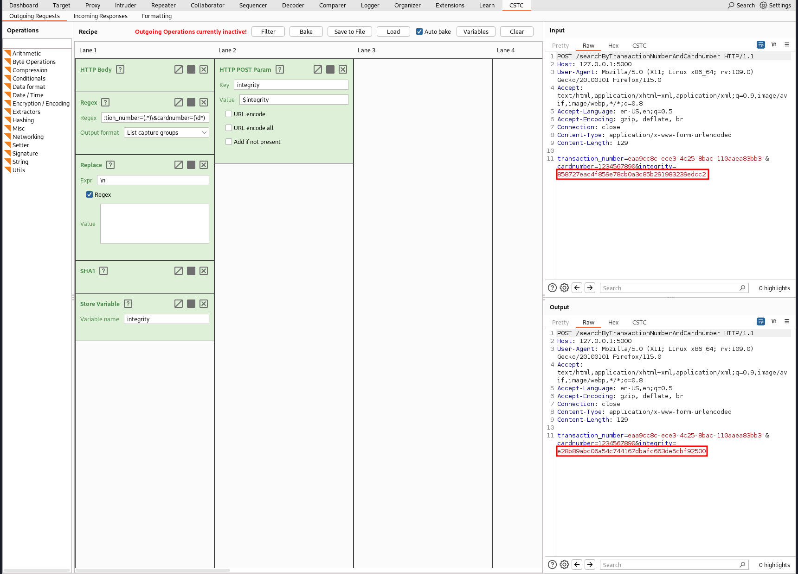

As you can see in the overview on the right, the value of the integrity parameter is now recalculated dynamically depending on the values of the request.

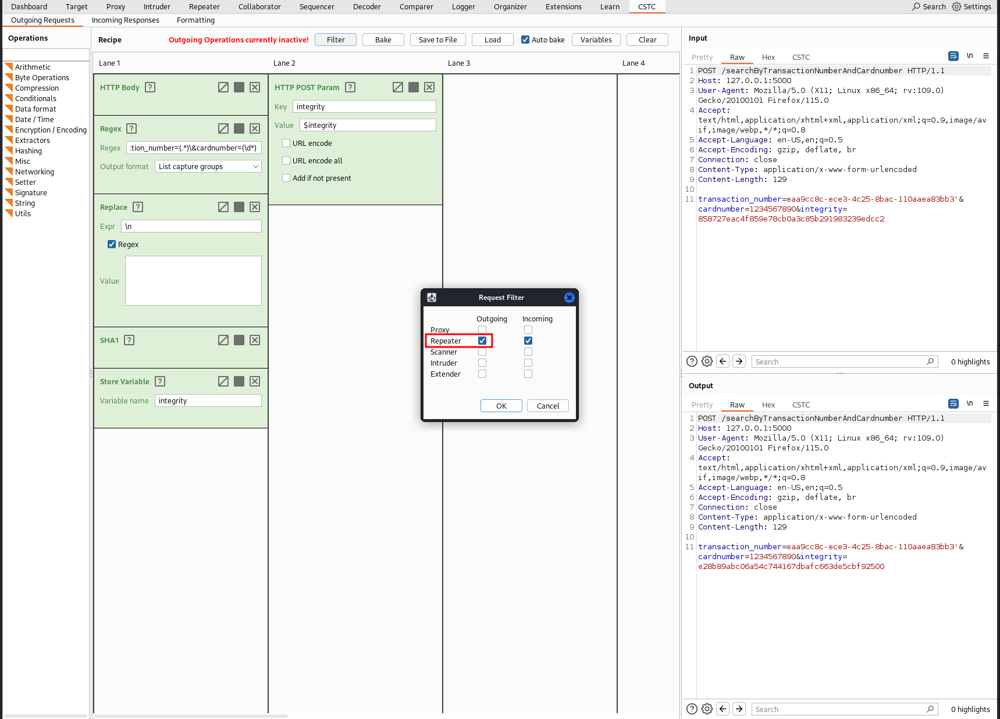

We now click on ```Filter``` again to select that the recipe should be applied to outgoing requests in the Repeater tab.

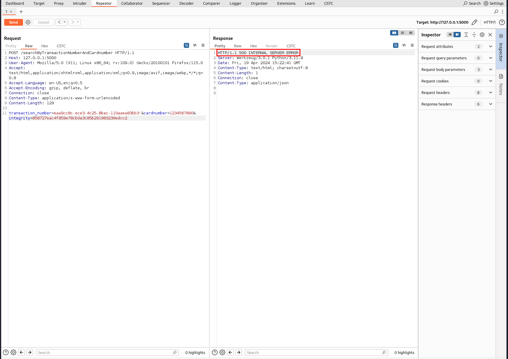

When resending the request in the Repeater tab, we receive an Internal Server Error, which means that the checksum test was successful and we can start testing the POST parameters.

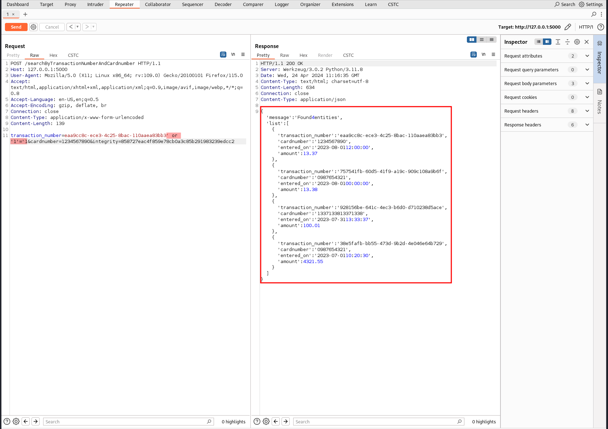

With an appropriately adapted payload, we can now verify and exploit a SQL injection vulnerability in this API endpoint.

### Automation with the help of the CSTC

Suppose we wanted to test the POST parameter using the Burp Scanner. Without adapting the integrity POST parameter, it is almost impossible to carry out a meaningful test. It is useful here that CSTC recipes can also be used for the Scanner.

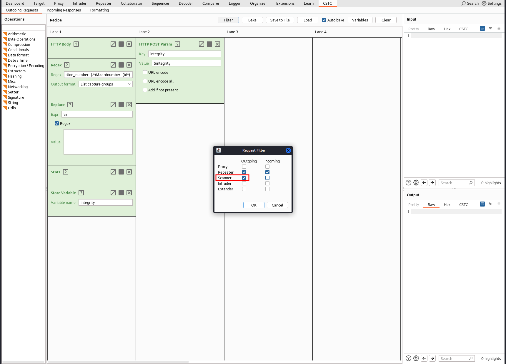

First, we activate the use of the CSTC recipe for the Scanner.

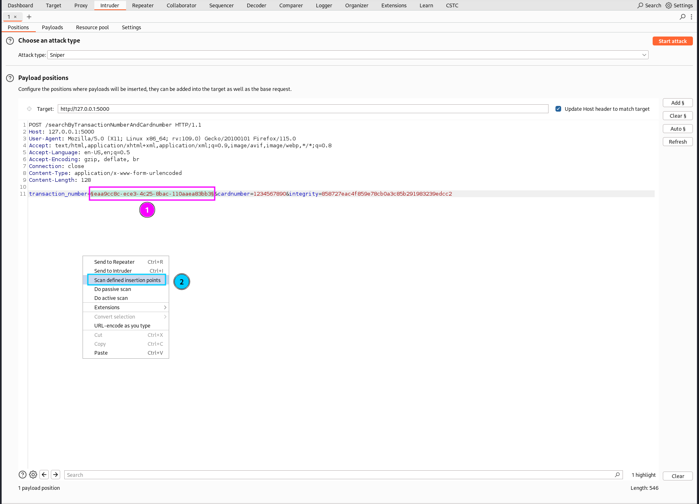

In the Intruder tab we now mark the parameter **(1)** to be tested and select the displayed menu item **(2)**. After selecting a suitable scan configuration, the scan can be started.


Using the CSTC recipe for outgoing requests, the Burp Scanner was able to confirm the SQLi as the CSTC transforms all requests containing payloads dynamically by applying the defined recipe shown above. This shows that the good integration of the CSTC can also be chained with other Extensions or builtin functions of BurpSuite.