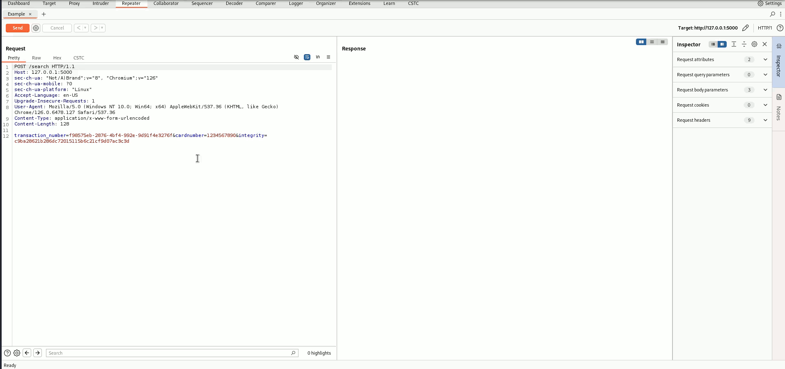

Copyright 2017-2020 usd AG

Licensed under the GNU General Public License, Version 3.0 (the "License"); you may not use this file except in compliance with the License.
You may obtain a copy of the License at https://www.gnu.org/licenses/gpl-3.0.html


# Cyber Security Transformation Chef
The Cyber Security Transformation Chef (CSTC) is a Burp Suite extension. It is build for security experts to
extend Burp Suite for chaining simple operations for each incomming or outgoing message.
It can also be used to quickly make a special custom formatting for the message.



## Introduction
[Burp Suite](https://portswigger.net/) is a general known tool which provides
a wide area of tools and functionality for conducting a web application penetration
test. One problem often encountered when using the Burp Suite for certain type of
web applications is the lack of a quick extensibility or the capability
of conducting basic operations on the messages.

The Burp Suite provides some functionality which can be used to adapt to certain scenarios
(i.e. the macro feature), however it is a time consuming process and error-prone.

With the years we developed a software which provides a GUI which is adapted from the well known
[CyberChef](https://gchq.github.io/CyberChef/) providing several small operations which can be chained
to conduct complicated input transformations. There is no need of further coding. The extension eliminates
the need of having several plugins for input and output transformations because it is build in a more generic way.

The CSTC is especially useful for using the quite good capabilities of Burp Suite Professional (Burp Scanner, Backslash Powered Scanner, ...)
on web applications using client side calculated MACs, sequence numbers, or similiar.

It is also a great help at analyzing obfuscated HTTP based protocols because it can be used to de- and reobfuscate the traffic
passing through the proxy. In this way, the analyst can concentrate on task of finding vulnerabilities
instead of writing new extensions for removing the obfuscation.

The plugin has been succesfully tested and decreased the time for performing the right tasks and not
"fighting with tool" to get what is needed to test.

## Prerequities
The CSTC can be used with either Burp Suite Free and Burp Suite Profesionnal.

## Installation

The CSTC is currently not listed in the Burp Extension Storage, but will be added there as soon as PortSwigger acknolwedges the Extension.

We suggest to pull the source code and build it yourself, because you should never trust binaries
and should always review the code which is used in a productive setting.

However, you can also pull a release from GitHub and install it by adding it the Burp Suite.

### Build Process

The build process is fairly easy. It currently requires a installed JDK and Maven to build.

You can build the extension with the following commands

```
git clone https://github.com/usdAG/cstc.git
cd cstc
mvn package
```

Maven will automatically load the dependencies for building the extension and will build
a jar containing all dependencies. The created Jar file CSTC-X.X.X-jar-with-dependencies in the target directory can be 
installed in Burp using the Extender->Add function.

## Usage
The tool uses a GUI which basic idea similar to the CyberChef. However, it introduces
a concept which we call "lane". The output of the transformation is always determined
from the the last lane which has an active operation. Take a look at a basic tutorial
[here](https://www.youtube.com/watch?v=BUXvWfb_YWU).

## Feedback
We gladly appreciate all feedback, bug requests and feature requests.
Please understand that this tool is under active development and therefore will
probably contain some bugs.
